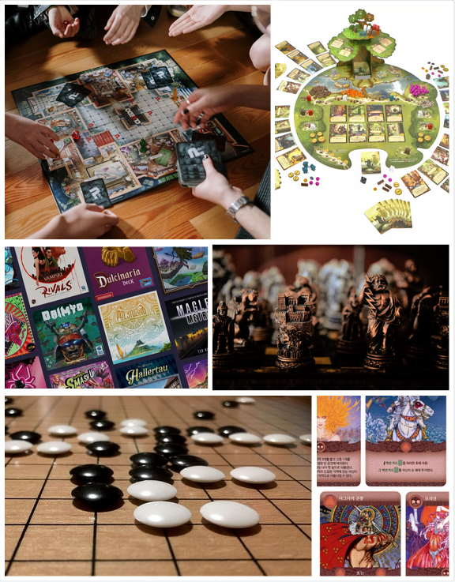
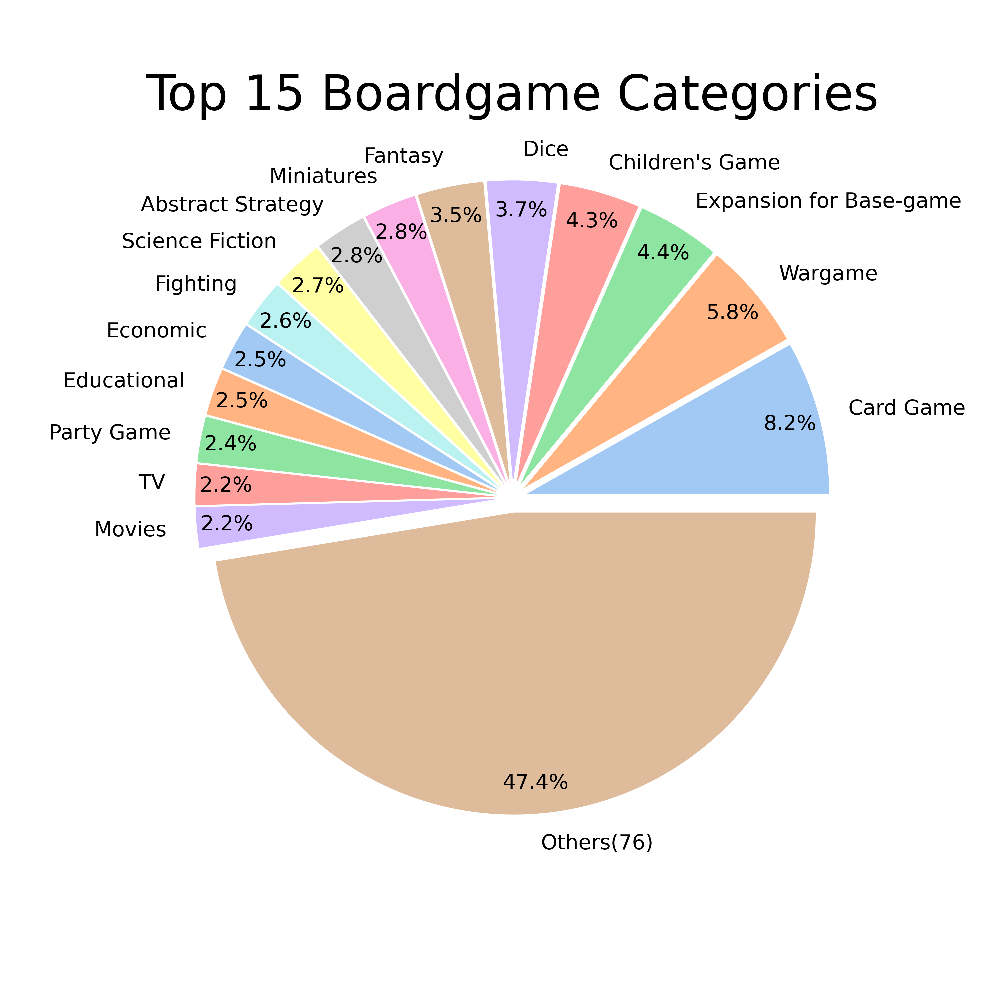
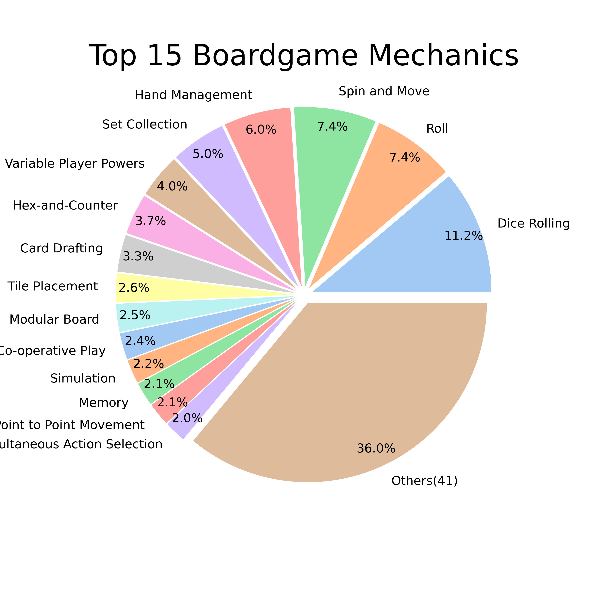
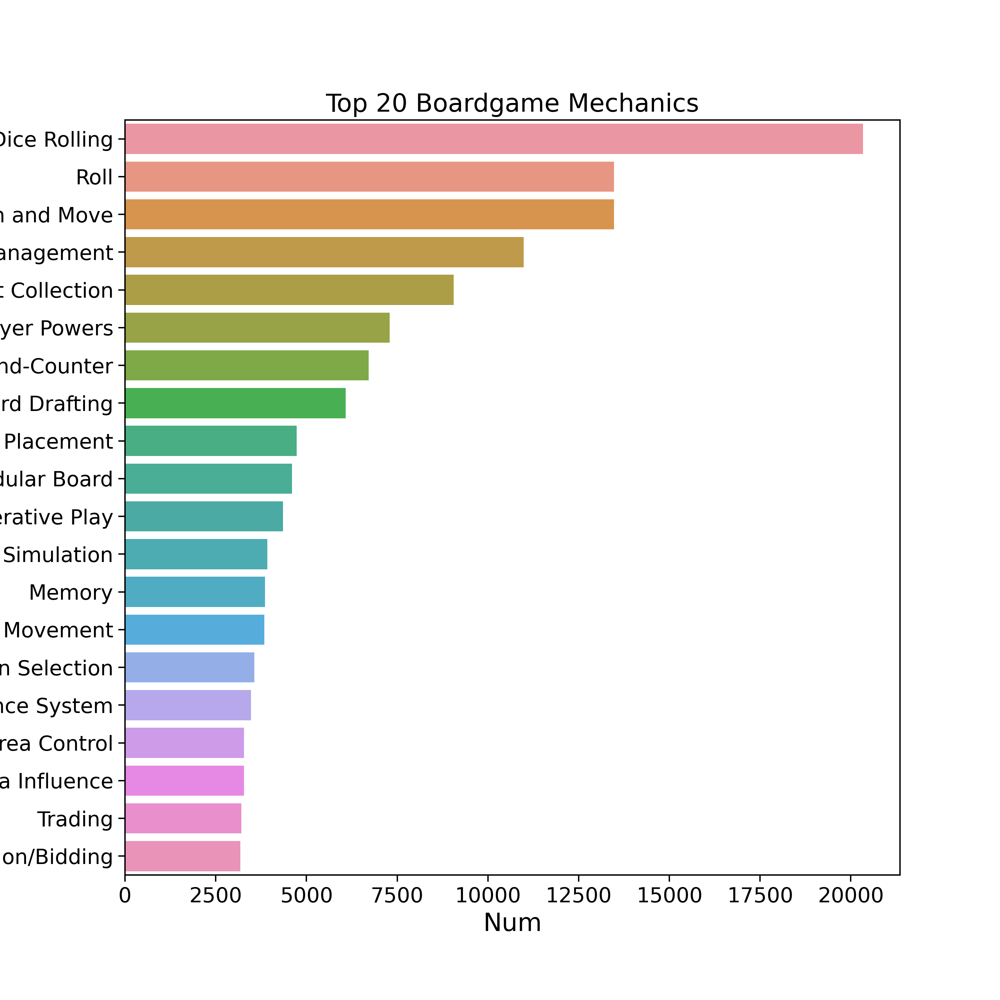
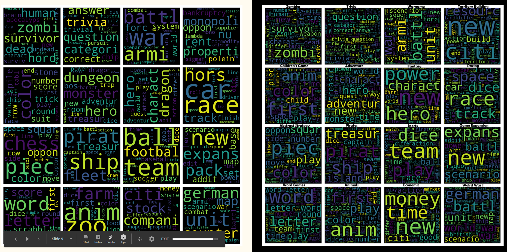
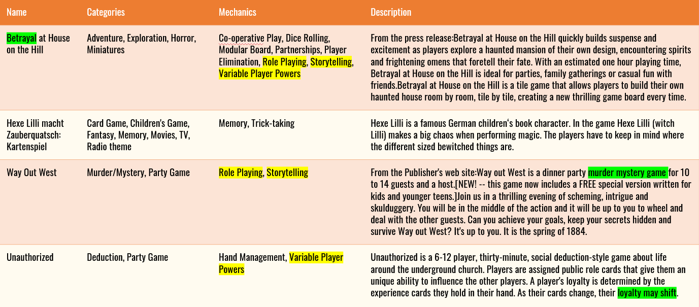

# Boardgame Recommendations
A recommender for boardgames based on individual preference.  <a href src="http://3.16.11.139:8080/">Try Recommender</a>

  

## Why Boardgames?

Not everyone that plays boardgames is too School for Cool hipster manbun millennial that likes to dress up and roleplay. Boardgames are a great way to spend quality, interactive time with family or friends. In addtion, boardgame PROS include :
* Multiplayer
* 2 to 6 hours
* provide human interaction
* intricately designed pieces, beautifully drawn art and visuals
* great to to exercise your brain with tactics and strategies
* Quaranine no end in sight(At least in CA). Boardgames is another way to keep entertained
  * You've already seen everything on Netflix, HBO, and Disney+

## Why a Recommender?
* Database I'm using alone has over 80,000 games
* over 80 categories, over 50 mechanics
* It's hard to pick up games out of the stack without any reference point
* Each game can cost form $40 to $80 USD on average, not a small committment to the average person!

## The Data

Data is scraped from BoardGameGeeks.com, an online boardgame repository must like IMDB for movies with ratings, descriptions, and much more. 
    * 74,264 games
    * 91 Categories
    * 56 Mechanics

 
  

## The Model
Model of the recommender uses CountVectorizer to vectorize game descriptions, and a model is built using Latend Dirichlet Allocation (LDA). 

A website is generated using flask and takes user input of one game, and returns a number of games most similar to the provided game, sorted by decending similarity.

## Example Output
For example, typing in "Betrayal", "3" into the site will give the following output.
Betrayal is a story building co-op game with a "betraying" player that is revealed as the game progresses. 

Note: The Descriptions of games here are shortened to a couple sentences for brevity purposes.

As shown in the highlighted words of the table, the recommender will consider similarities in theme, mechanics, setting, and category.

Try it out yourself <a href="http://3.16.11.139:8080/">here</a>!!

## Future Work
For the future, I'd like to improve the recommender by
* include a list of games for the user to choose from
* have the user be able to select more than one game in order to generate the recommendations
* add filters for mechanics and/or categories
* add average user ratings to output
* increase robustness of model with additional modeling techniques